# 🔒 F5-XC Vault CLI

**Automated Cryptographic Asset Blindfolding & Deployment for F5 Distributed Cloud (F5 XC)**

[](https://www.python.org/downloads/)
[](https://docs.cloud.f5.com/docs/how-to/volterra-cli/vesctl)
[](#cicd-pipeline-integration)

F5XC Vault CLI is a robust, pipeline-ready Python script that automates the secure deployment of TLS/SSL certificates to F5 Distributed Cloud. It seamlessly handles F5's proprietary Zero-Trust "Blindfolding" encryption, ensuring your private keys never traverse the network in plaintext.

## 📖 Table of Contents

* [Why this tool? (The F5 Blindfolding Concept)](#why-this-tool-the-f5-blindfolding-concept)
* [Architecture & Workflow](#architecture--workflow)
* [✨ Key Features](#-key-features)
* [🛠 Prerequisites](#-prerequisites)
* [🚀 Usage Guide](#-usage-guide)
  * [Standard Deployment](#standard-deployment)
  * [CI/CD Pipeline Integration](#cicd-pipeline-integration)
  * [Bulk Deployment (Bash Loop)](#bulk-deployment-bash-loop)
* [CLI Arguments Reference](#cli-arguments-reference)

## Why this tool? (The F5 Blindfolding Concept)

Unlike traditional cloud providers where you upload raw private keys directly to an API, **F5 Distributed Cloud uses a Zero-Trust model.** The F5 API will reject raw private keys.

Instead, keys must be **Blindfolded**. This means:

1. You download F5's global Public Key and a Policy Document.
2. You encrypt your private key *locally* on your machine or CI/CD runner.
3. You upload the securely encrypted (Blindfolded) key to the F5 console.

This script abstracts that entire complex process into a single, idempotent command.

## Architecture & Workflow

Here is exactly what the CLI does under the hood when you run it:

```mermaid
sequenceDiagram
    participant User as User / CI Pipeline
    participant CLI as F5XC Vault CLI
    participant Local as Local OpenSSL
    participant F5 as F5 XC API

    User->>CLI: Execute with cert, key, and .p12
    
    rect rgb(30, 40, 50)
    Note over CLI, Local: 1. Pre-Flight Validation
    CLI->>Local: Verify Modulus (does cert match key?)
    Local-->>CLI: Match Validated!
    end

    rect rgb(30, 40, 50)
    Note over CLI, F5: 2. Blindfold Encryption
    CLI->>F5: Request Public Key & Policy Document
    F5-->>CLI: Return cryptographic locks
    CLI->>CLI: Locally encrypt private key (Blindfold)
    end
    
    rect rgb(30, 40, 50)
    Note over CLI, F5: 3. Smart Deployment
    CLI->>F5: Does Certificate Object already exist?
    alt Object Exists
        F5-->>CLI: Yes
        CLI->>F5: Overwrite/Rotate Keys (Action: REPLACE)
    else Object is New
        F5-->>CLI: No
        CLI->>F5: Create New Object (Action: CREATE)
    end
    end
    
    F5-->>CLI: Deployment Successful
    CLI-->>User: Return 200 OK & JSON output
```



## ✨ Key Features

* **Automated Blindfolding:** Handles all public key fetching, policy binding, and payload structuring dynamically.
* **Cryptographic Pre-Validation:** Uses OpenSSL to verify that your `.pem` and `.key` actually match before attempting deployment, saving you from broken TLS handshakes.
* **Idempotent Executions:** Automatically detects if a certificate exists in F5 XC. If it's new, it creates it. If it exists, it prompts to safely rotate/update the keys.
* **CI/CD Ready:** Includes a `--force` flag for non-interactive pipeline automation and supports fetching passwords via environment variables.
* **Zero Traces:** Safely generates and destroys temporary `vesctl` configs and payload files to prevent credential leakage.

## 🛠 Prerequisites

Ensure the following dependencies are installed on the machine or CI/CD runner:

1. **Python 3.6+**
2. [**vesctl**](https://docs.cloud.f5.com/docs/how-to/volterra-cli/vesctl): The official F5 Distributed Cloud CLI binary must be installed and accessible in your system `$PATH`.
3. **OpenSSL**: Used locally for cryptographic modulus validation.
4. **F5 XC API Credential**: A `.p12` API credential generated from your F5 XC Console.

## 🚀 Usage Guide

### Standard Deployment (Manual Run)

It is highly recommended to export your `.p12` password as an environment variable to keep it out of your shell history.

```bash
# 1. Export your API password
export VES_P12_PASSWORD="your_secure_password"

# 2. Run the deployment
python3 f5xc_vault_cli.py \
    --tenant "my-company" \
    --p12-path "./api-creds.p12" \
    --cert-name "frontend-app-cert" \
    --cert-ns "production-ns" \
    --cert-file "./frontend.pem" \
    --key-file "./frontend.key"
```

*Note: If the certificate already exists, the script will pause and ask `[y/N]` if you wish to overwrite it.*

### CI/CD Pipeline Integration

When running in Jenkins, GitLab, GitHub Actions, etc., you cannot have the script pause for user input. Use the `--force` (or `-y`) flag to automatically create or rotate the certificate.

```bash
export VES_P12_PASSWORD="${{ secrets.F5_API_PASSWORD }}"

python3 f5xc_vault_cli.py \
    --tenant "my-company" \
    --p12-path "./api-creds.p12" \
    --cert-name "frontend-app-cert" \
    --cert-ns "production-ns" \
    --cert-file "./frontend.pem" \
    --key-file "./frontend.key" \
    --force
```

### Bulk Deployment (Bash Loop)

Want to deploy an entire folder of certificates? The script ignores files you don't explicitly pass to it, but you can easily wrap it in a bash loop. Assuming a directory of matching `.pem` and `.key` files:

```bash
export VES_P12_PASSWORD="your_secure_password"

for cert in *.pem; do
    basename="${cert%.*}"
    echo "Processing $basename..."
    
    python3 f5xc_vault_cli.py \
        --tenant "my-company" \
        --p12-path "api-creds.p12" \
        --cert-name "$basename-cert" \
        --cert-ns "production-ns" \
        --cert-file "$basename.pem" \
        --key-file "$basename.key" \
        --force
done
```

## CLI Arguments Reference

| Argument | Required | Default | Description | 
| :--- | :---: | :--- | :--- | 
| `--tenant` | ✅ | | Your F5 XC tenant prefix (e.g., `sdc-support`). | 
| `--p12-path` | ✅ | | Path to your `.p12` API credential file. | 
| `--cert-name` | ✅ | | The name for the resulting Certificate object in the F5 XC UI. | 
| `--cert-ns` | ✅ | | The F5 XC namespace where the certificate will be deployed. | 
| `--cert-file` | ✅ | | Path to your local Public Certificate (`.pem` / `.crt`). | 
| `--key-file` | ✅ | | Path to your local Private Key (`.key` / `.pem`). | 
| `--p12-password` | ❌ | *Env Var* | Can be passed via `VES_P12_PASSWORD` env var for security. | 
| `--pol-name` | ❌ | `ves-io-allow-volterra` | Name of the F5 blindfold policy to use. | 
| `--pol-ns` | ❌ | `shared` | Namespace where the blindfold policy resides. | 
| `--dry-run` | ❌ | `False` | Validates keys and generates the JSON payload without pushing to F5 XC. | 
| `--force` / `-y` | ❌ | `False` | Bypasses interactive safety prompts and auto-overwrites existing certs. |
